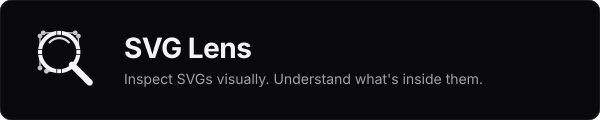

<p align="center">
  
</p>

# SVG Lens

Inspect SVGs visually. Understand what's inside them.

A minimal, precise, browser-based SVG viewer and inspection playground designed for developers, designers, and vector enthusiasts.

---

## Features

- **Visual-to-Code Synchronized Selection**: Click any element on the canvas to instantly reveal it in the DOM structure tree, inspect its geometric metrics, and jump directly to its exact line in the SVG source.
- **Precision Pan & Zoom Engine**: Smooth wheel zoom centered on cursor coordinates, click-drag pan, 1-click fit to viewport, 1-click 1:1 view reset, and live cursor coordinates `(X, Y)` mapped into SVG user space.
- **Non-Destructive Overlays**:
  - **Grid**: Subtle coordinate grid behind artwork.
  - **Coordinates**: Origin marker `(0, 0)` and viewBox bounds.
  - **Bounds**: Live bounding box dimensions and anchor tags.
  - **Outlines (Wireframe)**: Pure path wireframe mode stripping fills to reveal underlying vector curves.
- **Specialized Element Inspector**:
  - Identity (`id`, `class`) with quick-copy.
  - Visual visibility toggle (eye icon) to hide/reveal individual elements during inspection.
  - Live color swatches with HEX/RGB copy.
  - Live geometry metrics (`x`, `y`, `width`, `height`, `cx`, `cy`, `r`, transforms).
  - Path analytics: Total path length (px), command count, and detailed segment breakdown (`M`, `L`, `C`, `S`, `Q`, etc.).
  - Copy standalone element SVG snippet.
  - Key-value raw attributes table.
- **Document-Level Analytics**: When no element is selected, inspect canvas dimensions, viewBox, total elements count, breakdown by tag, and extracted color palette.
- **Integrated Source Inspector**: Formatted XML with syntax highlighting, line numbers, search within source, word wrap toggle, and one-click copy or download.
- **Multi-File Tab Management**: Seamlessly inspect and toggle between multiple opened SVGs.
- **Zero-Trust Client-Side Sanitization**: Untrusted SVG markup is sanitized in the browser to eliminate scripts, inline event handlers (`on*`), and dangerous external resource triggers before rendering.

---

## Why SVG Lens?

Most SVG tools focus on editing, compression, or conversion. When building web applications and design systems, developers frequently encounter vector graphics that render unexpectedly, have complex clip-paths, or harbor unintended artifacts.

SVG Lens was built to answer a simple question:

> **"Drop an SVG. Understand what's inside it."**

No AI marketing, no heavy dashboards, no login barriers, and no backend dependencies—just a handcrafted developer utility that does one thing exceptionally well.

---

## Architecture

SVG Lens is written in TypeScript and React 19, bundled with Vite, and styled using modern CSS and Tailwind tokens.

```
src/
├── core/
│   ├── parser.ts           # XML parsing, DOM indexing, line mapping
│   ├── sanitizer.ts        # Client-side XSS security sanitizer
│   ├── geometry.ts         # Live bounding box, path metrics & command analysis
│   └── samples.ts          # Curated SVG samples (Icons, Logos, Schematics)
├── state/
│   └── AppContext.tsx      # Unified state store (selection, canvas, tabs, layout)
├── components/
│   ├── Header/             # Minimal navigation, tabs, zoom, overlays, theme
│   ├── Canvas/             # Interactive pan/zoom viewport with overlays
│   ├── Tree/               # Collapsible DOM hierarchy with search & visibility
│   ├── Inspector/          # Element & Document inspection panels
│   ├── Source/             # Formatted XML source viewer with line sync
│   └── EmptyState/         # Serene drag-and-drop landing playground
├── types/
│   └── svg.ts              # Core TypeScript models
└── styles/
    └── index.css           # Neutral design system, checkerboards & scrollbars
```

---

## Privacy

**Your SVG stays in your browser.**

SVG Lens runs 100% locally on your machine. Files are parsed using native browser DOM APIs. No files or telemetry are ever transmitted to any remote server or third-party service.

---

## Development

### Prerequisites

- Node.js >= 18
- npm >= 9

### Setup

```bash
# Clone the repository
git clone https://github.com/Vishwas-Srivastav/SVG-Lens.git
cd SVG-Lens

# Install dependencies
npm install

# Start development server
npm run dev
```

### Typecheck & Build

```bash
# Validate TypeScript types
npm run typecheck

# Build production bundle
npm run build
```

---

## Contributing

Contributions are welcome! Please read [CONTRIBUTING.md](CONTRIBUTING.md) and review [docs/GUARDRAILS.md](docs/GUARDRAILS.md) before opening pull requests.

1. Cut a branch from `development` following the naming convention: `<INITIATIVE>-<NUMBER>` (e.g. `LENS-01`).
2. Adhere to [Conventional Commits](https://www.conventionalcommits.org/).
3. Ensure all engineering guardrails pass:
   ```bash
   ./scripts/check-guardrails.sh --all
   ```
4. Open a pull request targeting the `development` branch.

---

## License

This project is licensed under the MIT License - see the [LICENSE](LICENSE) file for details.
